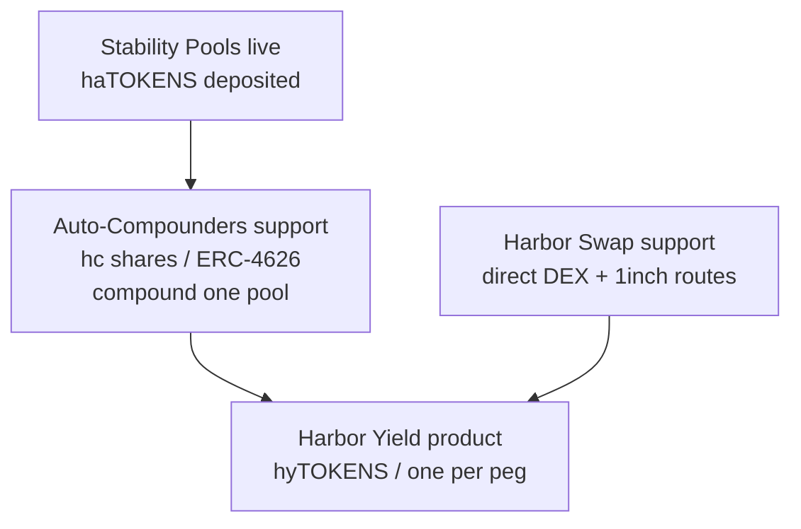

# Harbor Yield (hyTOKENS)

**Harbor Yield** is Harbor’s planned pooled-yield product for pegged tokens. Users hold a single **hyTOKEN** per peg (e.g. hyUSD) and earn concentrated stability-pool yield **without manually claiming and compounding** rewards.

Work is in progress on the `harbor-yield` contracts branch. Treat this page as the product design for the **mid-term** roadmap item — not as live mainnet UX yet. See [Roadmap](/roadmap).

## Why it exists

Today, earning amplified yield means:

1. Holding **haTOKENS**
2. Depositing them into a stability pool
3. Periodically claiming collateral rewards and deciding what to do with them

Harbor Yield automates that loop behind **hyTOKENS**. Supporting infrastructure — **auto-compounders** and **Harbor Swap** — does the claiming, compounding, and routing so the hyTOKEN basket stays productive.

## How it fits together

| Layer | Role |
| ----- | ---- |
| **Stability pools** | Live base yield layer (collateral + Sail) |
| **Auto-compounders** | Support for hyTOKENS — wrap a pool, auto-claim/compound rewards into haTOKENS |
| **Harbor Swap** | Support for hyTOKENS — move rewards between basket legs and equivalents |
| **hyTOKENS** | User-facing product — one share token per peg over a basket of strategies |

Advanced users can still use raw stability pools (or, where exposed, a single autocompounder) directly. The primary mid-term product surface is **hyTOKENS**.

## hyTOKENS (user product)

- **One Harbor Yield vault per peg** (e.g. **hyUSD**, **hyEUR**)
- Holds a basket of **auto-compounder** shares (and peg-equivalent yield wrappers such as fxSAVE-style adapters)
- You deposit and receive **hyTOKENS** — a multi-asset share that socializes rewards and losses across managed strategies for that peg
- Redeem returns a **proportional mix** of the basket (fairness-preserving; not a single-asset “pick the best leg” redeem)
- ERC-4626-style **views** (priced in peg units) for integrations; deposit/redeem APIs are Harbor Yield–specific

## Auto-compounders (support for hyTOKENS)

Auto-compounders are the per-pool engines underneath hyTOKENS — not a separate headline product.

- One autocompounder vault per stability pool (share tokens often styled **hc…**)
- Non-rebasing **ERC-4626** shares: fixed share count, rising share price as rewards compound
- Anyone (or keepers) can trigger `compound()`: claim collateral rewards → mint haTOKENS when fees allow → redeposit into the pool
- Losses and rewards stay within that single pool
- **hyTOKEN vaults hold these shares** as basket components (collateral-pool autocompounders and equivalents)
- Sail-pool autocompounders may exist for single-pool compounding but are **not** folded into hyTOKEN baskets (Sail rebalance receipts are less liquid)

## Harbor Swap (support for hyTOKENS)

[Harbor Swap](https://github.com/baofinance/harbor-swap) is a standalone swap registry and executor package consumed by Harbor Yield. It does **not** change the yield economics — it is the plumbing that moves tokens when the hyTOKEN vault needs to:

- Prefer minting haTOKENS from collateral rewards when fees are acceptable (no swap)
- Otherwise route residual rewards into **peg-equivalent** vault legs (e.g. fxSAVE ↔ wstETH on Ethereum)
- Rebalance the hyTOKEN basket between managed strategies over time

### Two execution modes

| Mode | When | How |
| ---- | ---- | --- |
| **Direct executors** | Peg-critical / hot path (`distribute`) | On-chain route registry → UniV3, Curve, Balancer, or fixed composite routes (e.g. fxSAVE ↔ wstETH). Predictable gas; no off-chain calldata. |
| **Aggregator** | Discretionary / long-tail (`redistribute`) | Keeper-built **1inch v6** routes, role-gated on Harbor Yield. Used when a pair is not registered as a direct route or for larger rebalances. |

Users holding hyTOKENS do not call Harbor Swap (or autocompounders) directly. Vault logic and keepers use them under the hood.

### Example (hyETH-style vault)

When a collateral autocompounder surfaces **fxSAVE** rewards into Harbor Yield:

1. If minting haETH is cheap enough → compound into haETH and redeposit to the collateral stability pool (**no swap**)
2. Otherwise → **direct swap** fxSAVE → wstETH via the registered composite executor and deposit into the wstETH equivalent vault
3. Optional later **redistribute** moves between basket legs via direct routes or 1inch when keepers rebalance weights

## What users get

| Preference | Use |
| ---------- | --- |
| Max control | Stay on stability pools |
| Simple “earn on this peg” | Hold **hyTOKENS** (auto-compounders + swap run underneath) |

## Relationship to other yield

- **Yield concentration** (haTOKENS in pools earning from full collateral) remains the base mechanic — see [How Yield is Generated](/yield)
- **Protocol revenue** (75% to pools / 25% buy TIDE) is unchanged — see [TIDE Tokenomics](/tide-token/tokenomics)
- **Maiden Voyage Yield Share** (~5% of a market’s revenue) is separate ownership upside for voyage participants — see [Maiden Voyage](/maiden-voyage)

Harbor Yield is about **operational convenience and pooling** on top of stability-pool yield, not a replacement for those economics.

## Status

- Designed and implemented in depth on the Harbor `harbor-yield` branch (AutoCompounder support layer, HarborYield / hyTOKEN core, related stability-pool / minter upgrades)
- Swap routing via [baofinance/harbor-swap](https://github.com/baofinance/harbor-swap) (registry + DEX executors + 1inch adapter)
- **Mid-term** product rollout after core markets and Maiden Voyage 2.0 maturity
- Watch [app.harborfinance.io](https://app.harborfinance.io) and this docs site for launch announcements
