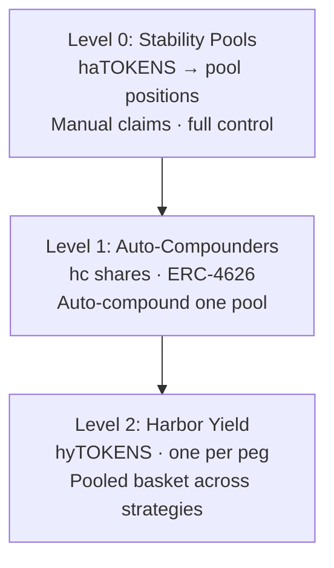

# Harbor Yield (hyTOKENS)

**Harbor Yield** is Harbor’s planned autocompounding and pooled-yield stack for pegged tokens. It sits on top of [Stability Pools](/stability-pools) so users can earn concentrated yield **without manually claiming and compounding** rewards.

Work is in progress on the `harbor-yield` contracts branch. Treat this page as the product design for the **mid-term** roadmap item — not as live mainnet UX yet. See [Roadmap](/roadmap).

## Why it exists

Today, earning amplified yield means:

1. Holding **haTOKENS**
2. Depositing them into a stability pool
3. Periodically claiming collateral rewards and deciding what to do with them

Harbor Yield automates that loop and, at the highest level, lets you hold a single **hyTOKEN** per peg (e.g. hyUSD) that represents a diversified basket of yield strategies for that peg.

## Three layers (escalating convenience)

### Level 0 — Raw Stability Pools (live)

- Deposit haTOKENS into Collateral or Sail stability pools
- You choose the market / pool and manage claims yourself
- Highest control; most operational overhead

### Level 1 — Auto-Compounders (planned)

- One autocompounder vault per stability pool (share tokens often styled **hc…**)
- Non-rebasing **ERC-4626** shares: fixed share count, rising share price as rewards compound
- Anyone (or keepers) can trigger `compound()`: claim collateral rewards → mint haTOKENS when fees allow → redeposit into the pool
- Losses and rewards stay within that single pool
- Available conceptually for both Collateral and Sail pools; Sail autocompounders are **not** folded into Harbor Yield baskets (Sail rebalance receipts are less liquid)

### Level 2 — Harbor Yield / hyTOKENS (planned)

- **One Harbor Yield vault per peg** (e.g. **hyUSD**, **hyEUR**)
- Holds a basket of Level-1 autocompounder shares (and peg-equivalent yield wrappers such as fxSAVE-style adapters)
- You deposit into the basket and receive **hyTOKENS** — a multi-asset share that socializes rewards and losses across managed strategies for that peg
- Redeem returns a **proportional mix** of the basket (fairness-preserving; not a single-asset “pick the best leg” redeem)
- ERC-4626-style **views** (priced in peg units) for integrations; deposit/redeem/compound APIs are Harbor Yield–specific
- When rewards or basket weights need to move between assets (e.g. fxSAVE → wstETH equivalent vault), Harbor Yield uses **Harbor Swap** — see below

## Harbor Swap (routing support)

[Harbor Swap](https://github.com/baofinance/harbor-swap) is a standalone swap registry and executor package consumed by Harbor Yield (and usable by other Harbor products). It does **not** change the yield economics — it is the plumbing that moves tokens safely when the vault needs to:

- Prefer minting haTOKENS from collateral rewards when fees are acceptable (no swap)
- Otherwise route residual rewards into **peg-equivalent** vault legs (e.g. fxSAVE ↔ wstETH on Ethereum)
- Rebalance the hyTOKEN basket between managed strategies over time

### Two execution modes

| Mode | When | How |
| ---- | ---- | --- |
| **Direct executors** | Peg-critical / hot path (`distribute`) | On-chain route registry → UniV3, Curve, Balancer, or fixed composite routes (e.g. fxSAVE ↔ wstETH). Predictable gas; no off-chain calldata. |
| **Aggregator** | Discretionary / long-tail (`redistribute`) | Keeper-built **1inch v6** routes, role-gated on Harbor Yield. Used when a pair is not registered as a direct route or for larger rebalances. |

Users holding hyTOKENS do not call Harbor Swap directly. Keepers and vault logic use it under the hood, with slippage floors and (for redistribute) role-gated access.

### Example (hyETH-style vault)

When a collateral autocompounder surfaces **fxSAVE** rewards into Harbor Yield:

1. If minting haETH is cheap enough → compound into haETH and redeposit to the collateral stability pool (**no swap**)
2. Otherwise → **direct swap** fxSAVE → wstETH via the registered composite executor and deposit into the wstETH equivalent vault
3. Optional later **redistribute** moves between basket legs via direct routes or 1inch when keepers rebalance weights

### Status

Harbor Swap is a separate repo with its own deployments (BaoFactory CREATE3). It ships as infrastructure for the mid-term Harbor Yield rollout.

## What users get

| Preference | Use |
| ---------- | --- |
| Max control | Stay on Level 0 Stability Pools |
| Auto-compound one market | Level 1 Auto-Compounder for that pool |
| Simple “earn on this peg” | Level 2 **hyTOKEN** Harbor Yield vault |

## Relationship to other yield

- **Yield concentration** (haTOKENS in pools earning from full collateral) remains the base mechanic — see [How Yield is Generated](/yield)
- **Protocol revenue** (75% to pools / 25% buy TIDE) is unchanged — see [TIDE Tokenomics](/tide-token/tokenomics)
- **Maiden Voyage Yield Share** (~5% of a market’s revenue) is separate ownership upside for voyage participants — see [Maiden Voyage](/maiden-voyage)

Harbor Yield is about **operational convenience and pooling** on top of stability-pool yield, not a replacement for those economics.

## Status

- Designed and implemented in depth on the Harbor `harbor-yield` branch (AutoCompounder, HarborYield core, related stability-pool / minter upgrades)
- Swap routing via [baofinance/harbor-swap](https://github.com/baofinance/harbor-swap) (registry + DEX executors + 1inch adapter)
- **Mid-term** product rollout after core markets and Maiden Voyage 2.0 maturity
- Watch [app.harborfinance.io](https://app.harborfinance.io) and this docs site for launch announcements
