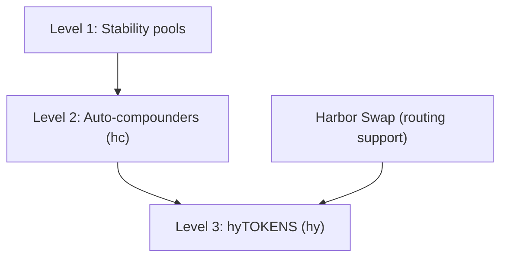

# Harbor Yield (hyTOKENS)

**Harbor Yield** is Harbor’s planned yield stack on top of stability pools. There are **three participation levels** — from full manual control up to a single pooled **hyTOKEN** per peg.

Work is in progress on the `harbor-yield` contracts branch ([harbor PR #33](https://github.com/baofinance/harbor/pull/33)). Treat this page as the product design for the **mid-term** roadmap item — not as live mainnet UX yet. See [Roadmap](/roadmap). Contract layers and deploy phases: [Tech docs — Harbor Yield](/tech-docs/contracts/harbor-yield). Swap plumbing: [Tech docs — Harbor Swap](/tech-docs/contracts/harbor-swap).

## Three participation levels

Every path starts by minting Harbor tokens. What you do next is the level:

<table>
  <thead>
    <tr>
      <th style="width: 5.5rem; white-space: nowrap;">Level</th>
      <th>What you do</th>
      <th>Tokens</th>
      <th>Claiming</th>
    </tr>
  </thead>
  <tbody>
    <tr>
      <td style="white-space: nowrap;"><strong>1</strong></td>
      <td>Mint <strong>ha</strong> / <strong>hs</strong>, deposit into a <strong>stability pool</strong>, claim rewards yourself</td>
      <td>ha / hs in the pool</td>
      <td>Manual</td>
    </tr>
    <tr>
      <td style="white-space: nowrap;"><strong>2</strong></td>
      <td>Mint <strong>ha</strong> / <strong>hs</strong>, deposit into an <strong>auto-compounder</strong> for that pool</td>
      <td><strong>hc…</strong> shares (ERC-4626) wrapping ha or hs pool deposits</td>
      <td>Automatic (<code>compound()</code>)</td>
    </tr>
    <tr>
      <td style="white-space: nowrap;"><strong>3</strong></td>
      <td>Mint / deposit into a <strong>hyTOKEN</strong> vault for that peg</td>
      <td><strong>hy…</strong> (e.g. hyUSD) — ha-side pooled product</td>
      <td>Automatic (vault + keepers)</td>
    </tr>
  </tbody>
</table>

- **Level 1** is live today (stability pools). Levels **2** and **3** ship with Harbor Yield.
- **Auto-compounders (level 2) are usable on their own** — not only as plumbing under hyTOKENS. Prefer a single pool and automatic compounding without entering the peg basket → use an AC.
- **hyTOKENS (level 3)** sit **next to** auto-compounders: the vault holds a basket of AC shares (and peg-equivalent legs). You can stay on level 2 or move up to level 3 for one share token per peg.

## Why it exists

Today, amplified yield (level 1) means:

1. Holding **haTOKENS** (and/or **hsTOKENS**)
2. Depositing them into a stability pool
3. Periodically claiming collateral rewards and deciding what to do with them

Harbor Yield adds:

- **Level 2** — per-pool auto-compounders so ha/hs depositors do not claim manually  
- **Level 3** — **hyTOKENS** so ha-side users can hold one pooled share per peg over several strategies  

[Harbor Swap](/tech-docs/contracts/harbor-swap) is routing support used by hyTOKEN vaults (and keepers), not a separate yield tier.

## How the stack fits together

### SVG

### Mermaid (contracts)

| Layer | Role |
| ----- | ---- |
| **Stability pools** | Live base yield / rebalance layer (collateral + Sail) |
| **Auto-compounders** | Usable per-pool product **and** building blocks inside hyTOKEN baskets |
| **hyTOKENS** | Optional pooled product — one share per peg over a basket of strategies |
| **Harbor Swap** | Moves rewards between basket legs when the hyTOKEN vault needs DEX routes |

## Level 1 — Stability pools (live)

Mint **ha** / **hs**, deposit into the collateral or Sail stability pool, claim rewards when you want. See [Stability Pools](/stability-pools) and [How Yield is Generated](/yield).

## Level 2 — Auto-compounders (usable product)

Auto-compounders wrap a single stability pool. You still mint **ha** or **hs** and deposit — but into the AC instead of (or on top of) interacting with the raw pool for compounding.

- One autocompounder per stability pool (share tokens often styled **hc…**)
- Non-rebasing **ERC-4626** shares: fixed share count, rising share price as rewards compound
- Anyone (or keepers) can trigger `compound()`: claim collateral rewards → mint haTOKENS when fees allow → redeposit into the pool
- Losses and rewards stay within that single pool
- Available for **ha** and **hs** (Sail) pools; Sail ACs may exist for single-pool compounding

**hyTOKEN vaults also hold these shares** as basket components (collateral-pool ACs and peg equivalents). Sail-pool ACs are **not** folded into hyTOKEN baskets (Sail rebalance receipts are less liquid) — but they remain available at level 2.

## Level 3 — hyTOKENS (pooled product)

- **One Harbor Yield vault per peg** (e.g. **hyUSD**, **hyEUR**) — **ha**-oriented pooled share
- Holds a basket of **auto-compounder** shares (and peg-equivalent yield wrappers such as fxSAVE-style adapters)
- You deposit and receive **hyTOKENS** — rewards and losses socialized across managed strategies for that peg
- Redeem returns a **proportional mix** of the basket (fairness-preserving; not a single-asset “pick the best leg” redeem)
- ERC-4626-style **views** (priced in peg units) for integrations; deposit/redeem APIs are Harbor Yield–specific

Users holding hyTOKENS do not need to call Harbor Swap or autocompounders directly — vault logic and keepers use them under the hood — but **the same auto-compounders remain available** if you prefer level 2.

### Harbor Swap (routing support for level 3)

[Harbor Swap](https://github.com/baofinance/harbor-swap) moves tokens when the hyTOKEN vault needs to mint ha from rewards, route residuals into peg-equivalent legs, or rebalance the basket. Direct DEX executors on the hot path; **Velora** (primary) / **1inch** (optional) on discretionary `redistribute`. Details: [Tech docs — Harbor Swap](/tech-docs/contracts/harbor-swap).

### Example (hyETH-style vault)

When a collateral autocompounder surfaces **fxSAVE** rewards into Harbor Yield:

1. If minting haETH is cheap enough → compound into haETH and redeposit to the collateral stability pool (**no swap**)
2. Otherwise → **direct swap** fxSAVE → wstETH via the registered composite executor and deposit into the wstETH equivalent vault
3. Optional later **redistribute** moves between basket legs when keepers rebalance weights

## What users get

| Preference | Level | Use |
| ---------- | ----- | --- |
| Max control | **1** | Mint ha/hs → stability pool → claim rewards yourself |
| Auto-compound one pool | **2** | Mint ha/hs → **auto-compounder** (ha or hs) |
| Simple “earn on this peg” | **3** | Hold **hyTOKENS** (basket of ACs + equivalents underneath) |

## Relationship to other yield

- **Yield concentration** (haTOKENS in pools earning from full collateral) remains the base mechanic — see [How Yield is Generated](/yield)
- **Protocol revenue** (75% to pools / 25% buy TIDE) is unchanged — see [TIDE Tokenomics](/tide-token/tokenomics)
- **Maiden Voyage Yield Share** (~5% of a market’s revenue) is separate ownership upside for voyage participants — see [Maiden Voyage](/maiden-voyage)

Harbor Yield is about **operational convenience and pooling** on top of stability-pool yield, not a replacement for those economics.

## Status

- Designed and implemented in depth on the Harbor `harbor-yield` branch (AutoCompounder product layer, HarborYield / hyTOKEN core, related stability-pool / minter upgrades)
- Swap routing via [baofinance/harbor-swap](https://github.com/baofinance/harbor-swap) (registry + DEX executors; Velora primary aggregator, 1inch optional — see open [PR #3](https://github.com/baofinance/harbor-swap/pull/3) / `velora-swap` branch)
- **Mid-term** product rollout after core markets and Maiden Voyage 2.0 maturity
- Watch [app.harborfinance.io](https://app.harborfinance.io) and this docs site for launch announcements
