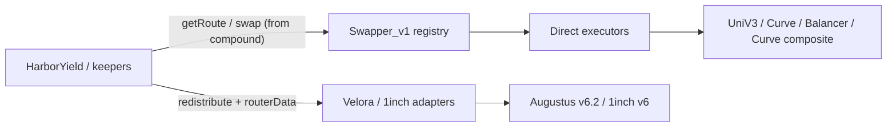

# Harbor Swap

> **Status**: Library live on `main`; **Velora** primary aggregator on open PR [`velora-swap` (#3)](https://github.com/baofinance/harbor-swap/pull/3)  
> **Repo**: [baofinance/harbor-swap](https://github.com/baofinance/harbor-swap)  
> **Consumed by**: [Harbor Yield](/tech-docs/contracts/harbor-yield) (and future Harbor products)

Integrator notes (not for mint/redeem): [Harbor Swap](../integrators/swap.md).

## Branch / PR snapshot (audit)

| Ref | State | What it delivers |
| --- | ----- | ---------------- |
| `main` | default | Registry + UniV3 / Curve / Balancer / FxSave↔wstETH executors; `SwapExecutorBase` hardening; `minAmountOutPerUnitIn` **rate** floor ([#2](https://github.com/baofinance/harbor-swap/pull/2), [#4](https://github.com/baofinance/harbor-swap/pull/4) merged) |
| `velora-swap` / [#3](https://github.com/baofinance/harbor-swap/pull/3) | **open** | **Velora Augustus v6.2** as primary aggregator adapter; 1inch remains optional |
| `refund-handling` | merged → main | Refund / amount-spent pro-rating on executor envelope |
| `swap-executor-hardening` | merged → main | Shared `SwapExecutorBase` (exact-pull, `ZeroAmountOut`, refunds) |
| `swap-adapter` | older branch | Historical adapter work |

Source docs on the PR branch: [`src/swap/README.md`](https://github.com/baofinance/harbor-swap/blob/velora-swap/src/swap/README.md), [`script/DEPLOY_SWAP.md`](https://github.com/baofinance/harbor-swap/blob/velora-swap/script/DEPLOY_SWAP.md).

## Architecture

| Field | Value |
| ----- | ----- |
| **Registry** | `Swapper_v1` — `(from, to) → {executor, routeCostRatio}` |
| **Direct executors** | UniV3, Curve, Balancer V2, `FxSaveWstEthSwapper_v1` (composite) |
| **Aggregators** | `VeloraSwapper_v1` (primary, PR #3); `OneInchSwapper_v1` (optional) |
| **Shared envelope** | `SwapExecutorBase` — same-token guard, exact pull, `amountOut == 0` reverts, authoritative `minAmountOutPerUnitIn` (out per 1e18 in **spent**), refund unspent |
| **Deploy** | BaoFactory CREATE3 via Harbor deploy helpers |

### Architecture diagram (SVG)

### Architecture diagram (Mermaid)

## Two execution modes

| Mode | Typical caller | Slippage / floor |
| ---- | -------------- | ---------------- |
| **Direct** | Hot path (`HarborYield.compound`) | Executor envelope: `minAmountOutPerUnitIn` — **rate** floor (out per 1e18 in **spent**) |
| **Aggregator** | Discretionary (`redistribute`) | Consumer-provided **absolute** `minAmountOut` (or equivalent) on the Yield/redistribute call; opaque `routerData` to Velora / 1inch |

Authorization for aggregators lives on the **consumer** (Harbor Yield), not inside the open-access adapter. Selector allowlists do **not** validate swap parameters — treat calldata as untrusted. Rely on the **direct** executor’s `minAmountOutPerUnitIn` for registry routes, and on the **absolute** output minimum for aggregator redistribute paths — do not assume the per-unit rate bound covers both modes.

### Velora (primary)

| Field | Value |
| ----- | ----- |
| **Why** | Fixed-router aggregator for low-urgency rebalances; public Market API without 1inch KYC |
| **Router** | Augustus v6.2 (same address pattern across supported chains) |
| **Keeper flow** | `GET /prices` (`version=6.2`, allowlisted methods) → `POST /transactions/:chainId` → `veloraSwapper` |
| **Selectors** | Allowlisted in `VeloraV62Selectors` (e.g. `swapExactAmountIn` / `swapExactAmountOut`) |
| **Addresses in quote** | `userAddress` = adapter proxy; `txOrigin` = redistributor EOA (or Safe, not the relayer) |

### 1inch (optional)

| Field | Value |
| ----- | ----- |
| **When** | Prefer 1inch path or Velora unavailable |
| **API** | Swap / Pathfinder (`swap` selector); typically needs 1inch developer KYC |
| **Adapter** | `OneInchSwapper_v1` on the same `SwapExecutorBase` |

## CREATE3 salt keys (peg-agnostic)

Full salt = `{saltPrefix}::{key}` (e.g. `harbor_v1::eth::swapper`). Predict with `_predictAddress` before deploy.

| Key | Contract |
| --- | -------- |
| `swapper` | `Swapper_v1` |
| `uniV3Swapper` | `UniV3Swapper_v1` |
| `curveSwapper` | `CurveSwapper_v1` |
| `balancerSwapper` | `BalancerSwapper_v1` |
| `veloraSwapper` | `VeloraSwapper_v1` |
| `oneInchSwapper` | `OneInchSwapper_v1` |
| `fxSaveWstEthSwapper` | `FxSaveWstEthSwapper_v1` (mainnet fxSAVE ↔ wstETH) |

Per-peg Harbor Yield salts (`{pegKey}::harborYield`, beacons, …) live in the yield consumer deploy config — not in this registry table.

## Deploy phases

| Phase | Repo | Delivers (swap-relevant) |
| ----- | ---- | ------------------------ |
| **1a** | [harbor](https://github.com/baofinance/harbor) `#33` | Minter_v3, StabilityPool_v3, StabilityPoolManager_v2 |
| **1b** | [harbor-price-aggregators](https://github.com/baofinance/harbor-price-aggregators) `#4` | Yield peg oracles (CREATE3) |
| **2a** | **harbor-swap** | This package — registry + executors + aggregators |
| **2b** | Harbor Yield consumer | `HarborYield_v1`, `Compounder_v1`, ERC-7575 doors, route wiring, `REDISTRIBUTOR_ROLE` |

Harbor Yield passes `swapper = _predictAddress("swapper")` as an immutable at HY deploy time.

## Known design tradeoffs

| Topic | Note |
| ----- | ---- |
| **FxSaveWstEth intermediate legs** | Some Curve hops use `min_dy = 0`; only final wstETH out is bounded by consumer `minAmountOut`. Route changes need impl upgrade. |
| **Aggregator openness** | Adapters are callable; safety is consumer role + envelope + `minAmountOut`. |
| **Mainnet discipline** | Deploy only via package deploy helpers; do not hard-code proxy addresses — use CREATE3 prediction. |

## See also

| Resource | Use for |
| -------- | ------- |
| [Harbor Yield](/tech-docs/contracts/harbor-yield) | Consumer stack / phases |
| [Harbor Yield (product)](/harbor-yield) | Velora vs 1inch in product language |
| [Supporting Features](/supporting-features) | Oracles + zaps vs yield plumbing |
| [Coverage audit](../coverage.md) | Open PR checklist |
| [Bao Factory](./bao-factory.md) | CREATE3 deployer |
