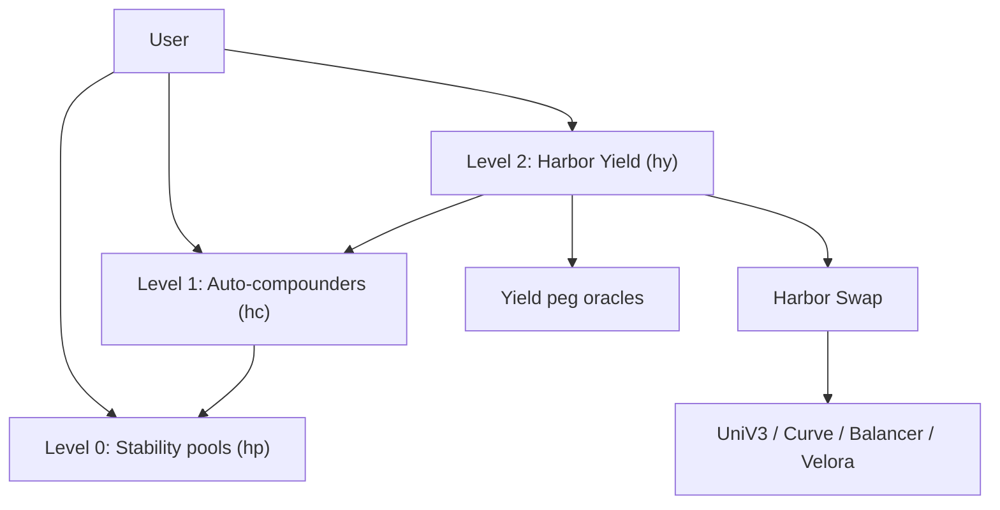

# Harbor Yield

> **Status**: In progress (not live mainnet UX)  
> **Repos**: [baofinance/harbor](https://github.com/baofinance/harbor) branch / PR [`harbor-yield` (#33)](https://github.com/baofinance/harbor/pull/33)  
> **Product overview**: [Harbor Yield (hyTOKENS)](/harbor-yield)

Harbor Yield is the mid-term **pooled yield** stack on top of stability pools: auto-compounders (**hc…**) and peg vaults (**hyTOKENS**). Tech docs here track the **contract surface and deploy phases**; product framing lives on the non-tech page.

## Layer model

| Level | Component | Share token | Role |
| ----- | --------- | ----------- | ---- |
| **0** | Stability pools (live today; upgrading to v3) | rebasing **hp…** | Base yield / rebalance layer |
| **1** | Auto-compounders (AC) | non-rebasing ERC-4626 **hc…** | Claim + compound rewards into the pool |
| **2** | Harbor Yield peg vault | custom multi-asset **hy…** | Basket of AC shares + peg-equivalent vaults |

Design source: [`doc/autocompounding-vault-design.md`](https://github.com/baofinance/harbor/blob/harbor-yield/doc/autocompounding-vault-design.md) on `harbor-yield`.

## Foundation contracts (`harbor` `harbor-yield`)

PR [#33](https://github.com/baofinance/harbor/pull/33) widens the **data envelope** and adds yield-facing hooks on the core stack:

| Contract | Version on branch | Notes |
| -------- | ----------------- | ----- |
| **StabilityPool** | **v3** | ERC-20 pool shares (Solady + EIP-2612); `uint256` reward integrals; floor clamps (`MIN_TOTAL_ASSET_SUPPLY`); clamp-then-fee withdrawals |
| **StabilityPoolManager** | **v2** | Manager updates for v3 pools / compounding flows |
| **Minter** | **v3** | Mint/redeem + fee paths aligned with the widened envelope and yield consumers |
| **Reward accumulator / distributor** | **v3** | Companion reward accounting upgrades |
| Interfaces | `IYieldVault`, `IYieldVaultManager` | Peg-vault surface for higher layers |

Numerical envelope / no-silent-truncation guarantees: [`doc/DataEnvelope.md`](https://github.com/baofinance/harbor/blob/harbor-yield/doc/DataEnvelope.md).

### Upgrade path (mainnet)

| Field | Value |
| ----- | ----- |
| **Scripts** | `script/Deploy_StabilityPool_v3_mainnet.s.sol`, `script/UpgradeStabilityPool_v2_v3/` |
| **State** | Continues to use BaoFactory CREATE3 + `harbor_v1.state.json` patterns |
| **Live status** | Treat as **pre-production** until the PR merges and upgrade batches are executed |

## hyTOKEN / AC product contracts

Higher-level **HarborYield_v1** peg vaults and autocompounder impls are designed in the autocompounding doc and consumed **with** [Harbor Swap](./harbor-swap.md). Deploy phase notes in swap’s `DEPLOY_SWAP.md` call this **Phase 2b** (consumer / yield vaults), after:

1. **Phase 1a** — Minter_v3 / StabilityPool_v3 / StabilityPoolManager_v2 (`harbor` `#33`)
2. **Phase 1b** — Yield peg oracles (`harbor-price-aggregators` `#4`)
3. **Phase 2a** — Swap registry + executors (`harbor-swap`)

| Field | Value |
| ----- | ----- |
| **hyTOKEN** | One vault per peg; proportional multi-asset redeem (not single-asset ERC-4626 redeem) |
| **Auto-compounder** | One per stability pool; `compound()` claims collateral rewards → mint ha when fees allow → redeposit |
| **Sail ACs** | May exist standalone; **not** included in hyTOKEN baskets (Sail receipts less liquid) |
| **Harbor Swap use** | Direct routes on hot path; Velora (primary) / 1inch (optional) on `redistribute` |

## Related oracles (pending)

[harbor-price-aggregators PR #4](https://github.com/baofinance/harbor-price-aggregators/pull/4) (`harbor-yield`) adds ETH-peg helpers Harbor Yield expects:

| Pair | Purpose |
| ---- | ------- |
| **ETH/ETH** | Constant 1e18 peg for haETH-style valuation |
| **Peg/ETH** | `peg_USD / ETH_USD` double feed |
| **stETH/ETH** | stETH/ETH + wstETH rate (wstETH valued in ETH) |
| **BTC/EUR/GOLD/MCAP/SILVER → ETH** | Mainnet wrappers for peg→ETH pricing |

Add inventory rows under [Mainnet price oracles](./price-oracles/mainnet.md) when addresses are deployed / merged.

## See also

| Resource | Use for |
| -------- | ------- |
| [Harbor Yield (product)](/harbor-yield) | User-facing hyTOKEN story |
| [Harbor Swap](./harbor-swap.md) | Registry, DEX executors, Velora |
| [Stability pool](./stability-pool.md) | Live v1/v2 pool behaviour |
| [Coverage audit](../coverage.md) | PR / branch checklist |
| [Zap contracts](./zap.md) | Separate Maiden Voyage convenience (not HY) |
