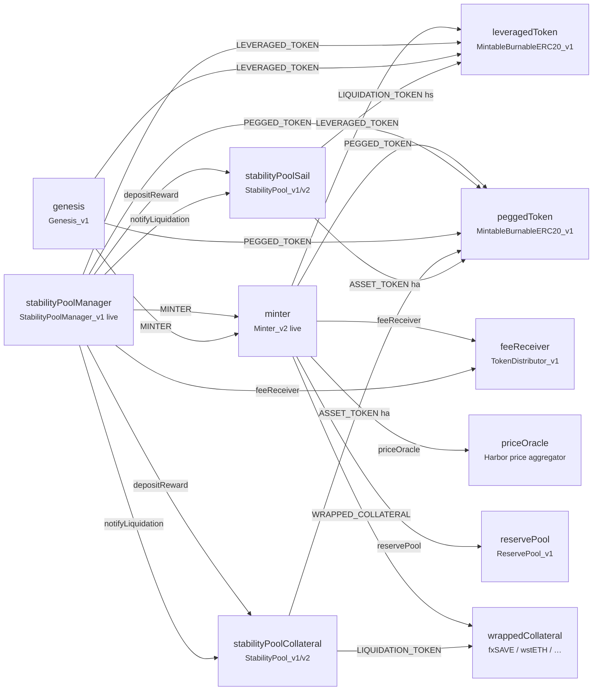

# Contract Architecture

Overview of Harbor Protocol contracts and how they interact.

## Architecture Diagram

### Mermaid

:::note
Collateral pool **liquidation / rebalance payout token** is the market’s **wrapped collateral** (e.g. fxSAVE / wstETH), not hs. Sail pool payout token is **hs**. Both pools’ deposit asset is **ha**. Live SPM wires **two immutable pools** (no runtime pool factory).
:::

## Core Contracts

### Minter
Central mint/redeem of ha and hs. Live: **Minter_v2**. Interacts with tokens, price oracle, reserve pool (discounts), and fee receiver.

### Stability Pool Manager
Coordinates the market’s **fixed** collateral + Sail pools: harvest → `depositReward`, rebalance → `notifyLiquidation`, bounty / protocol cut. Does **not** create pools on the fly.

### Stability Pools
1. **Collateral pool** — rebalance payout: **wrapped collateral**  
2. **Sail pool** — rebalance payout: **hs**

Both accept **ha** deposits. Live v1/v2 use compounding balances + claimable rewards (not gauges). SP_v3 ERC-20 shares are on the Harbor Yield branch (pre-prod).

### Reward System

- Accumulators / distributors under the pool inheritance tree track **claimable** reward tokens  
- ha balances adjust via the **loss product** on rebalance — separate from reward claims  

**Detail:** [Reward System Contracts](../contracts/reward-system.md).

## Data Flow

1. **Mint / redeem** — User ↔ Minter (wrapped collateral ↔ ha/hs); fees → feeReceiver; discounts → ReservePool when funded.  
2. **Stability pool** — User deposits/withdraws **ha**; claims reward tokens separately.  
3. **Rebalance** — CR below threshold → SPM `rebalance` → pools lose ha proportionally → payout tokens accrue as rewards.  
4. **Harvest** — SPM harvests wrapped-collateral yield → `depositReward` on both pools → users `claim`.
