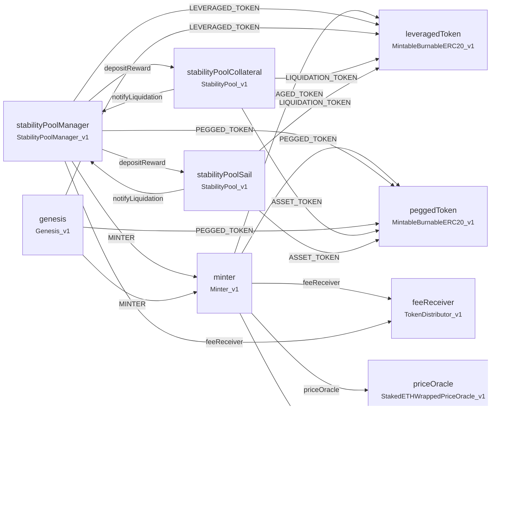

# Contract Architecture

This document provides an overview of the Harbor Protocol contract architecture and how contracts interact with each other.

## Architecture Diagram

### SVG

### Mermaid

## Core Contracts

### Minter
The central contract for minting and burning tokens. It interacts with:
- Token contracts (leveraged and pegged)
- Price oracle for valuations
- Reserve pool for protocol reserves
- Fee receiver for fee distribution

### Stability Pool Manager
Manages multiple stability pools. Coordinates:
- Pool creation and management
- Interactions with minter
- Fee distribution

### Stability Pools
Two types of stability pools:
1. **Collateral Pool**: Uses wrapped collateral (wstETH) for liquidations
2. **Sail Pool**: Uses leveraged tokens for liquidations

Both pools:
- Accept deposits of pegged tokens
- Distribute rewards via compounding accumulator
- Participate in rebalancing through StabilityPoolManager

### Reward System

- **MultipleRewardCompoundingAccumulator**: Tracks and compounds rewards for users
- **LinearMultipleRewardDistributor**: Distributes rewards linearly over time periods
- **Reward Tokens**: Multiple tokens supported (TIDE, wstETH from harvests, liquidation tokens)

**For detailed information, see [Reward System Contracts](../contracts/reward-system.md).**

## Data Flow

1. **Minting Flow**:
   - User deposits collateral → Minter → Mints tokens → Updates reserve pool → Distributes fees

2. **Stability Pool Flow**:
   - User deposits assets → Stability Pool → Updates balance → Earns rewards via compounding accumulator

3. **Rebalance Flow**:
   - Collateral ratio below threshold → StabilityPoolManager rebalances → Stability Pools participate → Distributes rebalance tokens as rewards

4. **Reward Flow**:
   - StabilityPoolManager harvests yield → Deposits rewards to pools → Rewards accumulate → Users claim rewards
